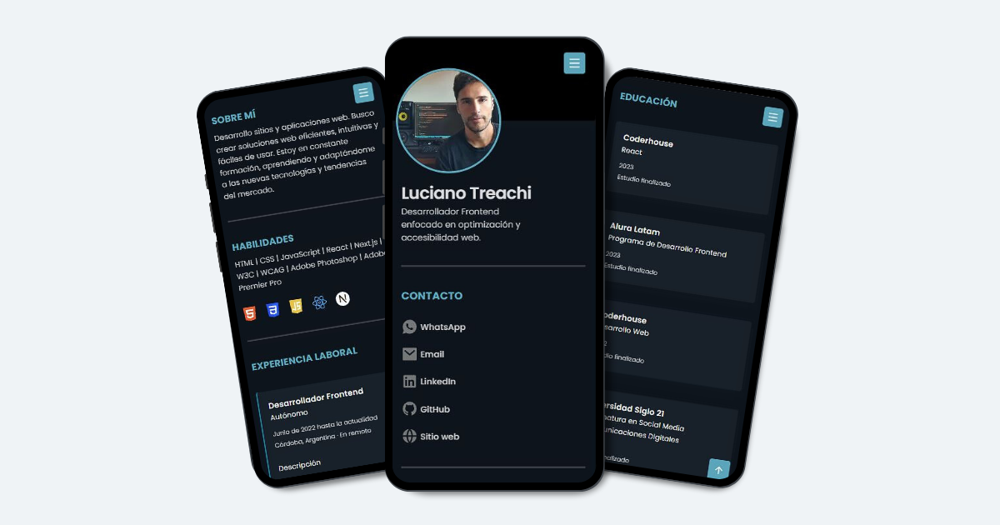

# Curriculum Vitae Web: Una forma moderna de compartir el CV

**Curriculum Vitae Web** es una solución interactiva para presentar mis datos personales, habilidades y experiencia profesional de manera online.

## Vista previa

## Características

- **Diseño minimalista**: Navegación simple e intuitiva centrada en la información clave.

- **Enlaces interactivos**: enlaces a plataformas como WhatsApp, Email, LinkedIn, GitHub y Sitio Web.
- **Responsivo**: Optimizado para computadoras, tablets y móviles.

- **Modo claro y oscuro**: Ideal para diferentes preferencias y condiciones de lectura.

## Tecnologías utilizadas

- HTML
- CSS
- JavaScript

## Comprueba cómo funciona

Accede aquí → [Curriculum Vitae Web](https://curriculumvitaeweb.netlify.app/)

## Desarrollado por

**Luciano Treachi**

Soy un Desarrollador Frontend dedicado a crear soluciones web eficientes, accesibles, intuitivas y fáciles de usar que potencian la experiencia del usuario.

